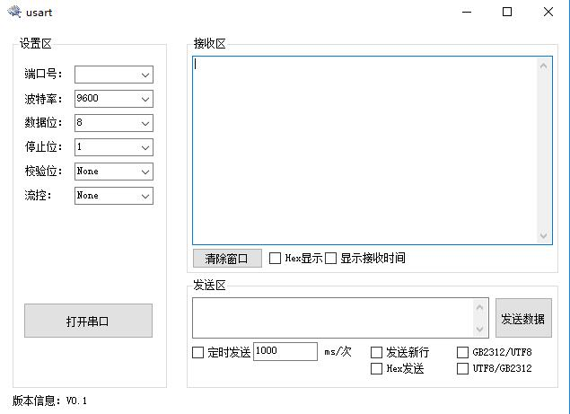

# 串口收发应用程序

> Author：Haven date：2016.4.11 。

功能优化及BUG解决：

1. 鼠标进入端口号下拉选择框区域并点击后,后台自动搜索可用串口并添加至下拉列表中。

2. 鼠标离开端口号下拉选择框区域时自动进行一些后台操作。
	- 若本次没有选择的端口号：

    	+ 若上次选择了端口号：检查上次的端口号是否依旧有效，若有效则沿用上次的端口号，否则选择最小的一个有效的端口号。
      	+ 若上次没有选择端口号，选择一个最小的有效端口号。
  	
  	- 若本次已经选择了端口号：
	
		+ 由于刚刚刷新了端口，所以无需检查。

3. 增加了启动后自动搜索可用端口并添加到下拉列表，若有可用端口则选择一个最小端口并初始化波特率。

4. 解决了接收时间间隔较短情况下程序崩溃的问题。因为操作系统是非实时操作系统，所以并不是每来一个数据之后都会进入接收应用程序
  所以每次读取所有已经存在的数据而不是一个数据。2016.4.14

5. 增加了发送、接收汉字的功能。2016.4.14

6. 增加软件开启时自动加载上次软件关闭时的端口号，并判断上次的端口号是否依旧可用。若有用则显示在文本框呢否则选择一个最小的可用端口号。2016.4.14

7. 重新排版，使之更加美观大方。增加了数据位、停止位、校验位、硬件流控等控件，但是并没有在程序上作进一步处理

8. 增加了以HEX方式发送时，对输入的文本进行格式判断

9. 增加了UTF8到GB2312码，GB2312码到TUF8码的转换功能2016.4.17

10. 只有定时选项没有定时功能

## 许可

[MIT](./LICENSE) &copy; [havenxie](http://github.com/havenxie)
